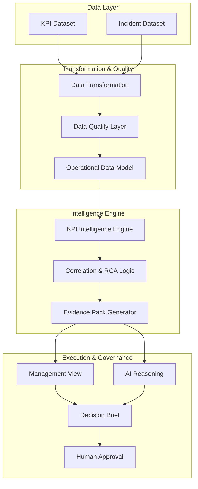

# Architecture: Telco Operations Intelligence & Decision Platform

## The Data-to-Decision Pipeline

## Core Principles
1. **Evidence over Magic**: The system does not pretend to have magical autonomous RCA. The reasoning is directly tied to the *quality of the operational evidence*.
2. **Confidence is not Permission**: A recommendation can have 99% confidence but still require human approval based on the *Action Risk* (e.g., redistributing 3.2M sessions).
3. **Traceability**: Every AI reasoning output is traceable back to the raw KPI deviation and network element.
